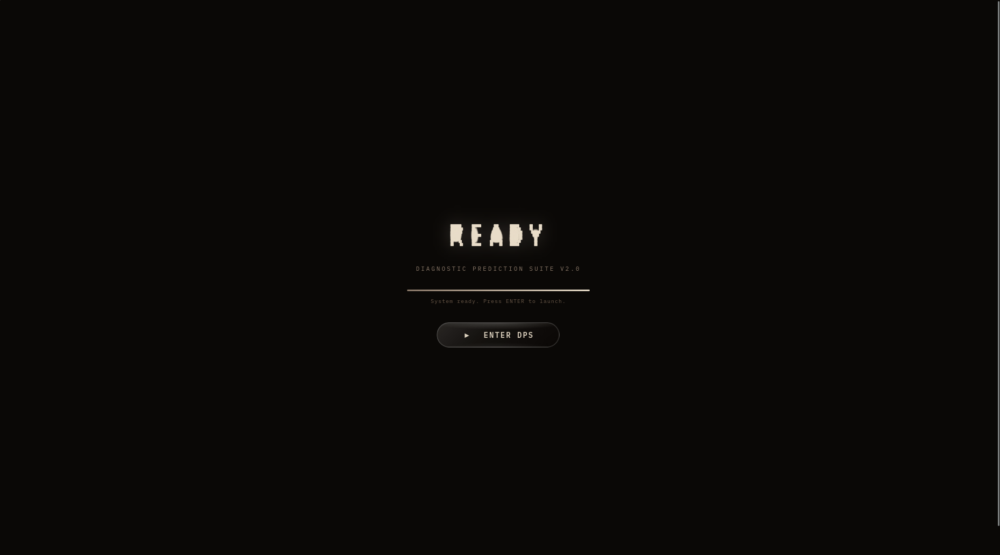
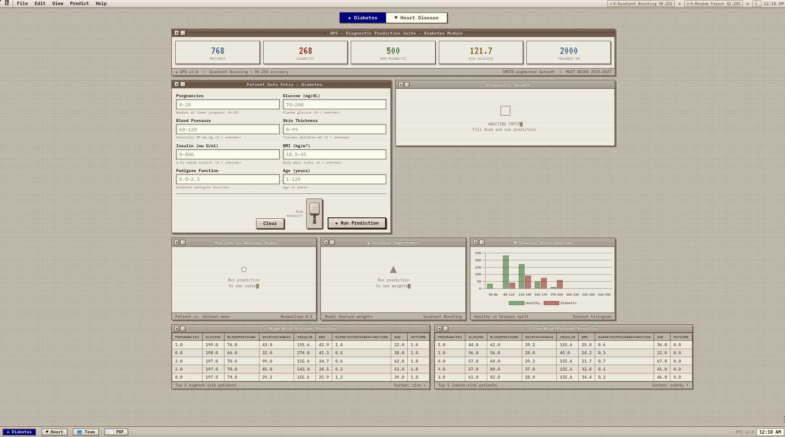
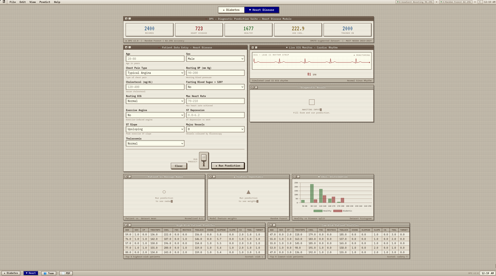
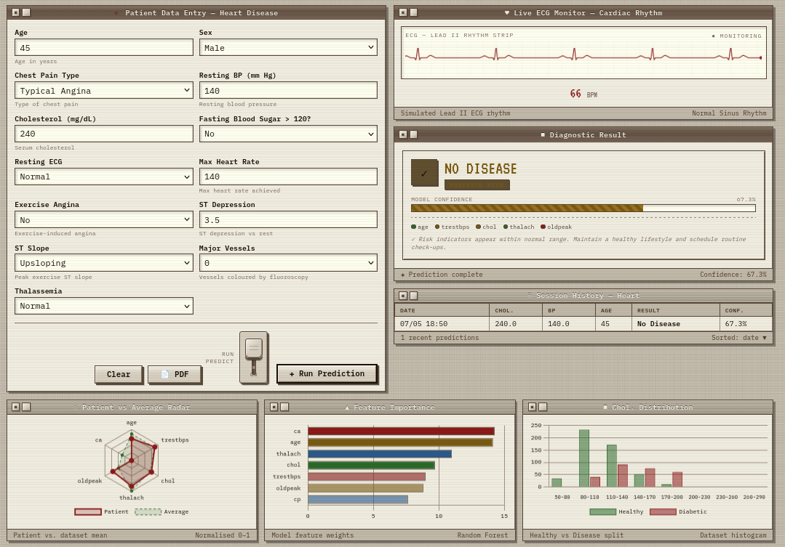
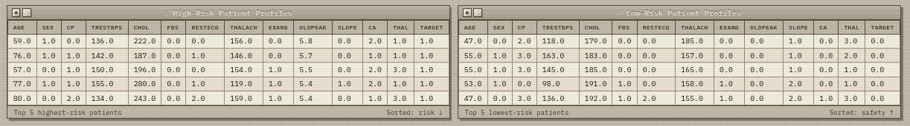
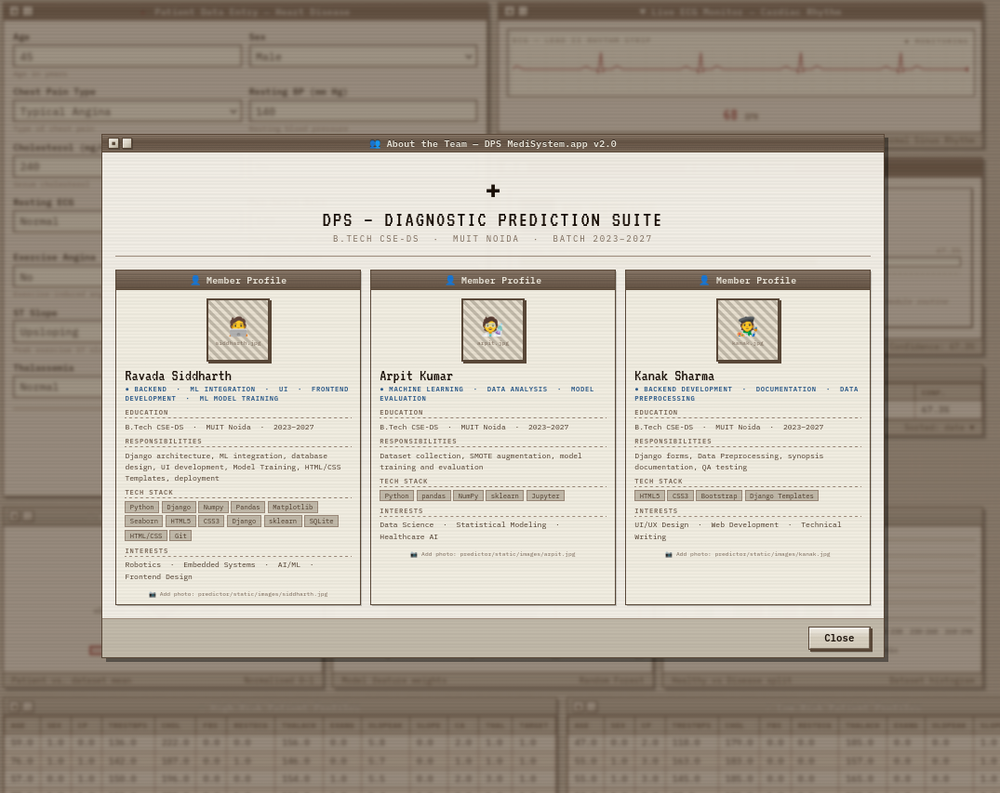
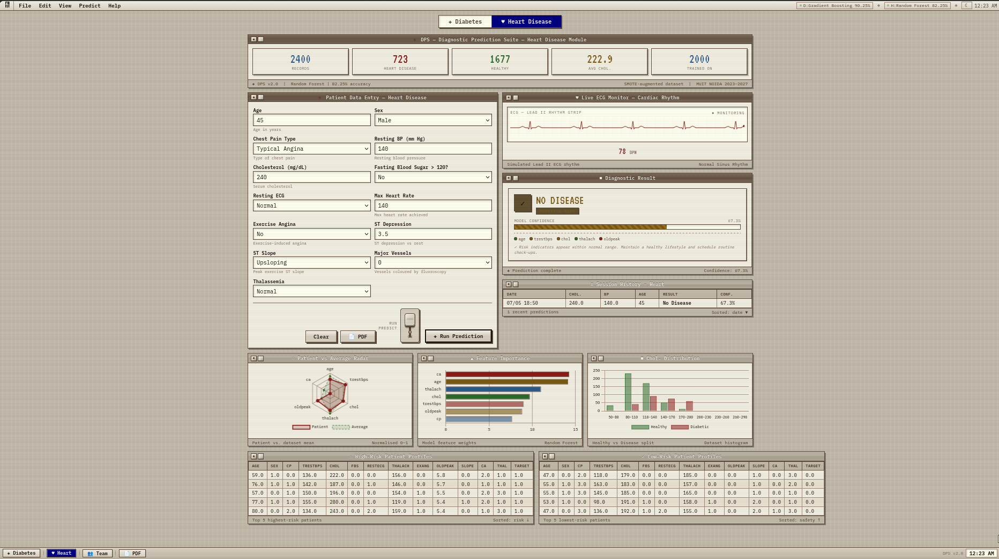
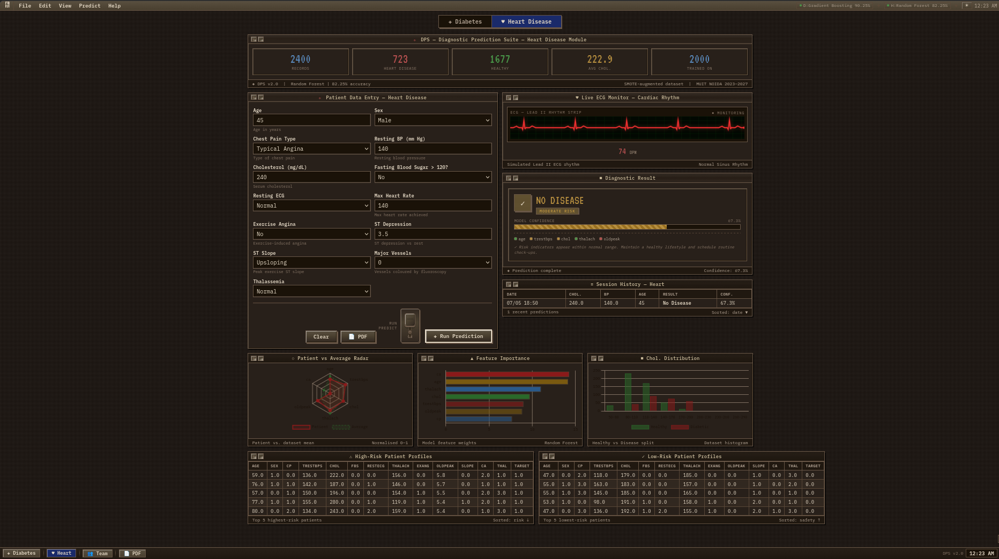

# DPS — Diagnostic Prediction Suite

A machine learning web application for diabetes and heart disease risk screening, built with Django and scikit-learn. Styled as a retro Apple Macintosh System 8 terminal interface.

---

## Screenshots

### Boot Sequence


### Dashboard — Diabetes Module


### Dashboard — Heart Disease Module


### Prediction Form + Result


### Charts — Radar / Feature Importance / Distribution


### Team Info Modal


### Day Mode vs Night Mode
| Day | Night |
|-----|-------|
|  |  |

---

## Project Info

**Institution:** Maharishi University of Information Technology (MUIT), Noida
**Program:** B.Tech — Computer Science & Engineering with Data Science
**Batch:** 2023–2027 (6th Semester)
**Subject:** Major Project

---

## What It Does

The system accepts patient health parameters through a web form and predicts the probability of diabetes or heart disease using a pre-trained machine learning model. It shows a confidence score, risk level, indicator breakdown, radar chart, feature importance chart, and distribution histogram. Predictions are saved to a database and shown in a history log. Reports can be exported as PDF.

---

## Datasets

### 1. Pima Indians Diabetes Dataset

| Field | Detail |
|-------|--------|
| Source | UCI Machine Learning Repository |
| Original collector | National Institute of Diabetes and Digestive and Kidney Diseases (NIDDK), USA |
| Records (original) | 768 patients |
| Records (after augmentation) | 2000 (1000 diabetic / 1000 non-diabetic) |
| Target variable | Outcome — 0 = Not Diabetic, 1 = Diabetic |

**Features:**

| Feature | Description | Unit |
|---------|-------------|------|
| Pregnancies | Number of times pregnant | count |
| Glucose | Plasma glucose concentration (2-hr OGTT) | mg/dL |
| BloodPressure | Diastolic blood pressure | mm Hg |
| SkinThickness | Triceps skinfold thickness | mm |
| Insulin | 2-hour serum insulin | mu U/ml |
| BMI | Body mass index | kg/m2 |
| DiabetesPedigreeFunction | Genetic diabetes risk score | score |
| Age | Age of patient | years |

**Engineered features added during preprocessing:**

| Feature | Formula | Purpose |
|---------|---------|---------|
| GlucoseAge | Glucose x Age / 1000 | Captures compounding glucose risk with age |
| BMIAge | BMI x Age / 1000 | Captures obesity risk scaling with age |
| InsulinGlucose | Insulin / (Glucose + 1) | Proxy for insulin resistance |

**Preprocessing:**
- Glucose, BloodPressure, SkinThickness, Insulin, BMI contain zeros representing missing values. Replaced with column mean of non-zero rows only.
- SMOTE applied to balance classes from 500/268 to 1000/1000.
- 2.5% Gaussian noise added to SMOTE samples for diversity.

---

### 2. Heart Disease Dataset (Synthetic — Framingham/Cleveland Distributions)

| Field | Detail |
|-------|--------|
| Generation method | Statistically realistic simulation |
| Statistical basis | Framingham Heart Study (NHLBI) + Cleveland Heart Disease Dataset (UCI) |
| Clinical basis | AHA/ACC Cardiovascular Risk Guidelines 2019 |
| Records (generated) | 2400 raw |
| Records (after balancing) | 2000 (1000 disease / 1000 healthy) |
| Target variable | target — 0 = No Disease, 1 = Heart Disease |

A real-world dataset was not publicly downloadable in the network environment, so a statistically equivalent dataset was generated using published feature distributions and logistic regression coefficients from Framingham and Cleveland literature.

**Features:**

| Feature | Description | Values |
|---------|-------------|--------|
| age | Patient age | 28–80 years |
| sex | Sex | 0=Female, 1=Male |
| cp | Chest pain type | 0=Typical Angina, 1=Atypical, 2=Non-anginal, 3=Asymptomatic |
| trestbps | Resting blood pressure | mm Hg |
| chol | Serum cholesterol | mg/dL |
| fbs | Fasting blood sugar >120 mg/dL | 0=No, 1=Yes |
| restecg | Resting ECG result | 0=Normal, 1=ST-T abnormality, 2=LV hypertrophy |
| thalach | Maximum heart rate achieved | bpm |
| exang | Exercise-induced angina | 0=No, 1=Yes |
| oldpeak | ST depression (exercise vs rest) | mm |
| slope | Slope of peak exercise ST segment | 0=Upsloping, 1=Flat, 2=Downsloping |
| ca | Major vessels coloured by fluoroscopy | 0–3 |
| thal | Thalassemia type | 1=Normal, 2=Fixed Defect, 3=Reversible Defect |

---

## Machine Learning

### Diabetes Model

| Item | Detail |
|------|--------|
| Algorithm | Gradient Boosting Classifier |
| Test accuracy | 90.25% |
| ROC-AUC | 0.9557 |
| Training records | 2000 (SMOTE-balanced) |
| Features | 11 (8 original + 3 engineered) |
| Hyperparameters | n_estimators=250, learning_rate=0.08, max_depth=5, subsample=0.85 |

Top features by importance: GlucoseAge (32.34%), BMI (13.49%), Glucose (11.51%), Age (10.2%), InsulinGlucose (9.8%)

### Heart Disease Model

| Item | Detail |
|------|--------|
| Algorithm | Random Forest Classifier |
| Test accuracy | 82.25% |
| ROC-AUC | 0.9007 |
| Training records | 2000 (SMOTE + undersampling) |
| Features | 13 |
| Hyperparameters | n_estimators=300, max_depth=12, min_samples_leaf=2, class_weight=balanced |

### Model Selection
Both Gradient Boosting and Random Forest were trained for each disease. The model with the higher ROC-AUC on a held-out 20% stratified test set was saved. The trained model, scaler, feature names, zero-replacement means, feature importances, and dataset metadata are saved as a single pickle bundle loaded once at Django startup via ml_service.py.

---

## Tech Stack

| Layer | Technology |
|-------|-----------|
| Backend | Python 3.10+, Django 5.x |
| ML | scikit-learn, imbalanced-learn (SMOTE) |
| Data | pandas, NumPy |
| Database | SQLite 3 (Django ORM) |
| Frontend | HTML5, CSS3, Django Templates |
| Charts | Chart.js 4.4.0 (CDN) |
| PDF Export | jsPDF 2.5.1 (CDN) |
| Fonts | IBM Plex Mono, VT323 (Google Fonts) |
| Audio | Web Audio API (no external files) |

---

## Project Structure

```
DPS/
├── diabetes_project/
│   ├── settings.py
│   ├── urls.py
│   ├── diabetes.csv                  ← Pima Indians Diabetes Dataset
│   ├── heart_disease.csv             ← Synthetic cardiovascular dataset
│   ├── diabetes_model_bundle.pkl     ← Trained model + metadata
│   └── heart_model_bundle.pkl        ← Trained model + metadata
├── predictor/
│   ├── ml_service.py                 ← Both models loaded once at startup
│   ├── views.py                      ← Handles both disease predictions
│   ├── models.py                     ← PredictionRecord DB model
│   ├── forms.py                      ← DiabetesForm + HeartDiseaseForm
│   ├── urls.py
│   ├── migrations/
│   └── templates/
│       └── index.html                ← Full retro terminal UI
├── screenshots/                      ← Add your screenshots here
├── manage.py
└── README.md
```

---

## UI Features

- **Boot screen** — Gooey morphing text (DPS → BOOT → INIT → ... → READY) using SVG goo filter. Enter via liquid glass button. Skips automatically on prediction reload.
- **Menu bar** — File, Edit, View, Predict, Help menus all functional with real actions
- **Lever switch** — Industrial-style physical lever next to Run Prediction button; flipping it submits the form
- **Taskbar** — Disease switching, Team modal, PDF export buttons all clickable
- **Sound effects** — Soft sine-wave audio on typing, clicks, submit, open/close
- **ECG monitor** — Animated PQRST waveform on the Heart Disease tab
- **Charts** — Radar (patient vs dataset average), Feature Importance, Glucose distribution histogram
- **Risk indicators** — Per-field colour dots (green/amber/red) showing clinical reference zones
- **Prediction history** — Last 8 predictions saved to SQLite
- **PDF export** — Branded A4 report with result, confidence bar, feature importance, disclaimer
- **Day / Night mode** — Warm off-white vs deep sepia palette, saved to localStorage
- **Scanline overlay** — Subtle CSS texture over the full page

---

## Installation

```bash
# Install dependencies
pip install django scikit-learn imbalanced-learn pandas numpy --break-system-packages

# Or use a virtual environment
python -m venv venv
source venv/bin/activate
pip install django scikit-learn imbalanced-learn pandas numpy
```

```bash
# Run
unzip DPS-3.0.zip
cd DPS-3.0
python manage.py migrate
python manage.py runserver
# Open: http://127.0.0.1:8000/
```

---

## Team

**B.Tech CSE-DS — MUIT Noida — Batch 2023–2027**

| Member | Roles |
|--------|-------|
| Ravada Siddharth | ML Integration, UI, Frontend Development, ML Model Training, Documentation |
| Arpit Kumar | ML Model Training, Model Evaluation, Documentation |
| Kanak Sharma | Frontend Development, Documentation, Data Preprocessing, Documentation |

---

## References

1. Smith, J.W. et al. — *Using the ADAP learning algorithm to forecast the onset of diabetes mellitus* — SCAMC, 1988
2. Kavakiotis, I. et al. — *Machine Learning and Data Mining Methods in Diabetes Research* — CSBJ, 2017
3. Sisodia, D. & Sisodia, D.S. — *Prediction of Diabetes using Classification Algorithms* — Procedia CS, 2018
4. Dawber, T.R. et al. — *Epidemiological approaches to heart disease: the Framingham Study* — AJPublicHealth, 1951
5. Detrano, R. et al. — *International application of a new probability algorithm for coronary artery disease* — AJCardiology, 1989 (Cleveland Dataset)
6. Grundy, S.M. et al. — *2018 AHA/ACC Cardiovascular Risk Guidelines* — Circulation, 2019
7. Django Documentation — https://docs.djangoproject.com
8. scikit-learn Documentation — https://scikit-learn.org
9. imbalanced-learn — https://imbalanced-learn.org

---

## Disclaimer

DPS is an academic machine learning project developed at MUIT Noida. All predictions are computational estimates for educational purposes only and do not constitute medical advice or clinical diagnosis. Always consult a qualified healthcare professional.
